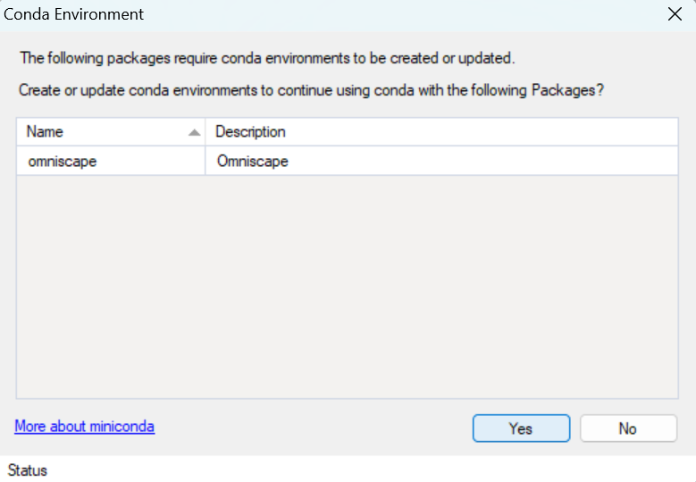

# Getting started with **omniscape** SyncroSim

To get started working with **omniscape** SyncroSim, begin by:
<A href="#installing-syncrosim-and-julia">1. Installing SyncroSim and Julia</A>
<A href="#installing-the-omniscape-syncrosim-package">2. Installing the **omniscape** SyncroSim package</A>

Once these requirements have been installed, the following tutorials cover the basics of the **omniscape** SyncroSim package:
<A href="#reproducing-the-omniscape.jl-example-with-omniscape-syncrosim">1. Reproducing the Omniscape.jl example with **omniscape** SyncroSim</A> #zzz: fix link
<A href="#measuring-the-impact-of-connectivity-change-with-omniscapeimpact">2. Measuring the impact of connectivity change with omniscapeImpact</A> #zzz: fix link

 

## **Installing SyncroSim and Julia**

Running **omniscape** SyncroSim requires that SyncroSim and Julia be installed on your computer. 
1. Download SyncroSim version 2.4.40 or higher [here](https://syncrosim.com/download/){:target="_blank"} and follow the installation prompts. 
2. Download Julia version 1.5.4 or higher [here](https://julialang.org/downloads/){:target="_blank"} and follow the installation prompts.

 

## **Installing the omniscape SyncroSim package**

1. Open SyncroSim Desktop.
2. Select **Files > Packages**

3. The *Packages* window will open, listing all the SyncroSim packages installed in your computer. To install a new package from the Package Server, click **Install**.

4. A new window will open listing the packages available for install from the Package Server. To install **omniscape** SyncroSim, mark the checkbox beside the package name and click **OK**. 

5.	The **omniscape** SyncroSim package uses Conda to manage the package dependencies. Upon installing the package, you will be prompted to install Conda if it is not already installed in your computer. Then, you will be prompted to create or update the Conda environment for **omniscape** SyncroSim. Click **Yes**.  

6.	Return to the *Packages* window, **omniscape** will now be listed along with the other installed packages, and the Conda checkbox will be marked.

