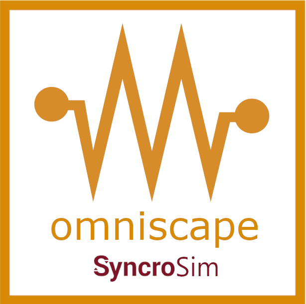

# **omniscape** SyncroSim Package

    <a href="https://github.com/ApexRMS/omniscape">
 

## Omni-directional habitat connectivity based on circuit theory

The **omniscape** SyncroSim Package is an open-source [SyncroSim](https://syncrosim.com/){:target="_blank"} base package for running [Omniscape.jl](https://docs.circuitscape.org/Omniscape.jl/stable/){:target="_blank"} and calculating omni-directional habitat connectivity. 

The **omniscape** SyncroSim Package allows users to run the latest Omniscape.jl code without ever having to interact with Julia directly. Rather, through SyncroSim, users can interact with Omniscape.jl using either a Windows user interface or through scripts written in R (using [rsyncrosim](https://syncrosim.com/r-package/){:target="_blank"}) or Python (using [pysyncrosim](https://pysyncrosim.readthedocs.io/en/latest/){:target="_blank"}). For details on model parameters and configurations, see the [Omniscape.jl documentation](https://docs.circuitscape.org/Omniscape.jl/stable/usage/#Settings-and-Options){:target="_blank"}.

  

## Requirements

The **omniscape** SyncroSim Package has two requirements:
* SyncroSim [version 2.4.5](https://syncrosim.com/download/){:target="_blank"} or higher
* Julia [version 1.5.4](https://julialang.org/downloads/){:target="_blank"} or higher

> Instructions for installing the above requirements for the **omniscape** SyncroSim Package are provided on the [Getting Started](https://apexrms.github.io/omniscape/getting_started.html) page.

> The latest version of the Omniscape.jl Julia package will be automatically installed during runtime.

 

## Getting Started

For a guided tutorial on the **omniscape** SyncroSim Package, see the [Getting Started](https://apexrms.github.io/omniscape/getting_started.html) page.

 

## Key Links

Browse source code at
[http://github.com/ApexRMS/omniscape/](http://github.com/ApexRMS/omniscape/){:target="_blank"}.  
Report a bug or contribute an idea at
[http://github.com/ApexRMS/omniscape/issues](http://github.com/ApexRMS/omniscape/issues){:target="_blank"}.  
Omniscape.jl documentation at [https://docs.circuitscape.org/Omniscape.jl/stable/](https://docs.circuitscape.org/Omniscape.jl/stable/){:target="_blank"}.  

 

## Developers

Carina Rauen Firkowski (Author, maintainer) 
 
Bronwyn Rayfield (Author) 
 
Katie Birchard (Author)
 
Colin Daniel (Author) 
