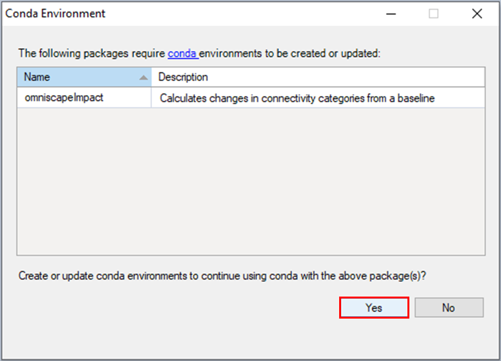
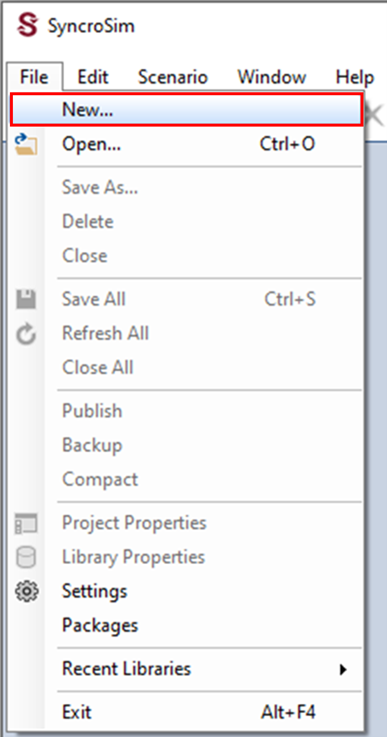
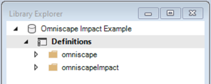
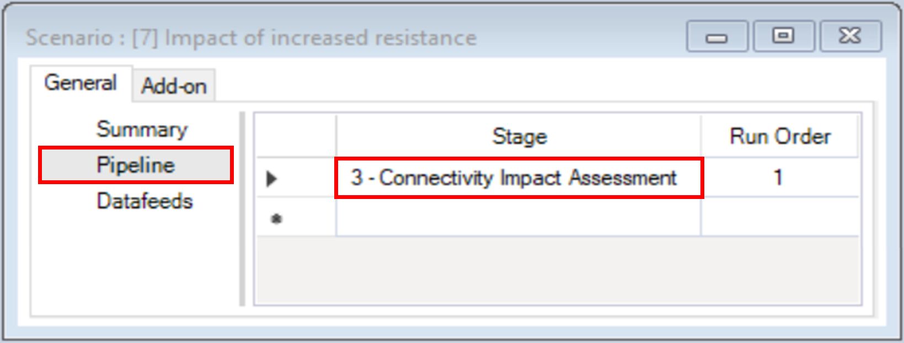
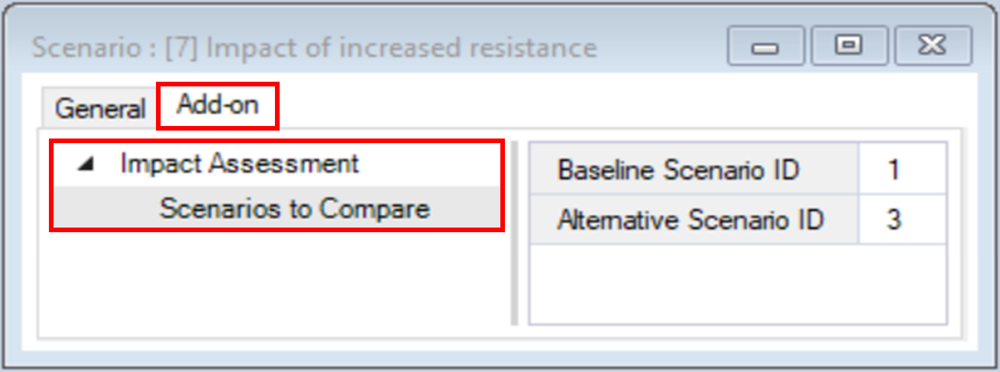
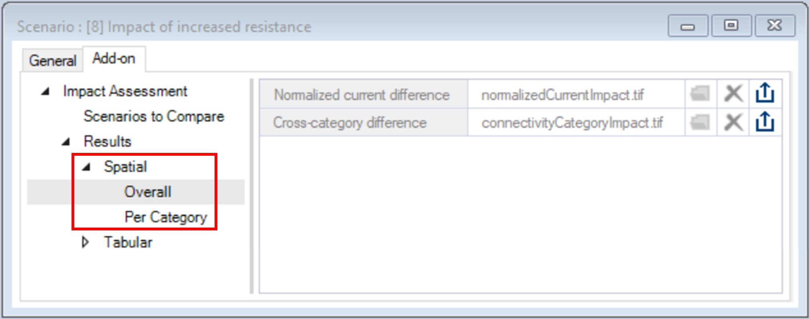

## **Measuring the impact of connectivity change with omniscapeImpact**

This tutorial guides you through using the **omniscapeImpact** add-on package to **omniscape SyncroSim**. It covers the following steps:
<A href="#step-1.-installing-the-omniscapeimpact-package">Step 1. Installing the omniscapeImpact package</A>
<A href="#step-2.-creating-and-configuring-an-omniscapeimpact-syncrosim-library">Step 2. Creating and configuring an omniscapeImpact SyncroSim Library</A>
<A href="#step-3.-visualizing-and-comparing-scenario-results">Step 3. Visualizing and comparing scenario results</A>

_**Requirements**_ #zzz: fix link
Before you begin, make sure that the **omniscape** SyncroSim package version 1.1.0 is installed. For more information, see <A href="#installing-the-omniscape-syncrosim-package">Installing the **omniscape** SyncroSim package</A>.

 

_**Step 1. Installing the omniscapeImpact package**_
1\.	Open SyncroSim Desktop.
2\.	Select **File > Packages**.

3\.	The *Packages* window will open, listing all the SyncroSim packages installed in your computer. To install a new package from the Package Server, click **Install**.

4\.	A new window will open listing the packages available for install from the Package Server. To install **omniscapeImpact**, mark the checkbox beside the package name and click **OK**. 

5\.	The **omniscapeImpact** package uses Conda to manage the package dependencies. Upon installing the package, you will be prompted to create or update the Conda environment for **omniscapeImpact**. Click **Yes**.

6\.	Return to the *Packages* window, **omniscapeImpact** will now be listed along with the other installed packages, and the Conda checkbox will be marked.

_**Step 2. Creating and configuring an omniscapeImpact SyncroSim Library**_
1\.	Open SyncroSim Desktop.
2\.	To create a new library, select **File > New**.

  a.	From the list of packages, select **omniscape**.
  b.	Select the **Omniscape Impact** template library. If desired, you may edit the *File name*, and change the *Folder* by clicking on the *Browse* button. Click **OK**.
  

A new library will be created based on the selected template, and SyncroSim will automatically open and display it in the Library Explorer window.

1\.	Note that the library contains two folders: *omniscape* and *omniscapeImpact*.
2\.	Expand the **omniscape** folder and note that it contains three scenarios.

The first two scenarios were covered in the tutorial <A href="#reproducing-the-omniscape.jl-example-with-omniscape-syncrosim">Reproducing the Omniscape.jl example with **omniscape** SyncroSim</A>. 
The additional scenario, *Decreased resistance*, represents the case where resistance has been decreased by a similar magnitude as in the *Increased resistance* scenario.
3\.	Next, expand the **omniscapeImpact** folder and note that it contains two scenarios:
  a.	*Impact of increased resistance* – compares the *Reference resistance* and *Increased resistance* scenarios.
  b.	*Impact of decreased resistance* – compares the *Reference resistance* and *Decreased resistance* scenarios.

4\.	Double-click on *Impact of increased resistance* to open the scenario properties.
5\.	Under the *General* tab, navigate to the **Pipeline** datasheet.
Note that it lists one pipeline stage, *Connectivity Impact Assessment*.

6\.	Navigate to the **Add-on** tab. 
  a.	Under the *Impact Assessment* node, you will find the package’s only datasheet, called *Scenarios to Compare*. 

It takes as input the ID of the two scenarios to be compared:
  i.	*Baseline Scenario ID* – represents the reference connectivity state from which changes will be measured. For this example, the ID is *1* corresponding to the *Reference resistance* scenario.
  ii.	*Alternative Scenario ID* – represents the changed connectivity state. For this example, the ID is *2* corresponding to the *Increased resistance* scenario.
7\.	Close the scenario properties.

_**Step 3. Visualizing and comparing scenario results**_
The Omniscape Impact template library already contains the results for all its scenarios. In SyncroSim, the results for a scenario are organized into a Results folder, nested within its parent scenario. 
1\.	In the Library Explorer window, click on the arrow beside the **Impact of increased resistance** scenario to expose the *Results* folder; repeat the same action to expose the results scenario. 

2\.	Double-click on the results scenario to open its properties.
3\.	Navigate to the **Add-on** tab and expand the **Results** node. 

The **omniscapeImpact** package generates spatial and tabular outputs. 
4\.	Under the *Spatial* node are the following outputs:
  a.	*Overall* – represents per pixels change in normalized current flow or connectivity category. 
  b.	*Per Category* – represents per pixels loss, gain and no change for each connectivity category.

5\.	Under the *Tabular* node are the following outputs:
  a.	*Differences Summary* – represents the change in area and percent cover between the baseline and alternative scenarios for each connectivity category.
  b.	*Transitions Summary* – represents the change in area and percent cover between the baseline and alternative scenarios for all possible transitions between connectivity categories.
  c.	*Jaccard Dissimilarity* – represents the dissimilarity between the baseline and alternative scenarios for each connectivity category. For each connectivity category, the Jaccard Dissimilarity is calculated as 1 minus the ratio between the number of shared pixels across scenarios and the total number of pixels across scenarios.

6\.	Close the scenario properties and collapse the results and scenario folder.

You will now visualize the tabular outputs of **omniscapeImpact**.
7\.	In the Library Explorer window, select the scenarios **Impact of increased resistance** and **Impact of decreased resistance**, right-click, and select **Add to Results** from the context menu. 

8\.	Navigate to the **Charts** tab and double-click to view the **Area difference** chart. 

Note that the two scenarios had opposite effects on connectivity. 
The Increased resistance scenario led to an increase in area for *Impeded* and *Channelized* and a decrease in area for *Diffuse* and *Intensified*, relative to the Reference scenario. 
The Decreased resistance scenario led to a decrease in area for *Impeded* and *Channelized* and an increase in area for *Diffuse* and *Intensified*, relative to the Reference scenario. 
Note also that the magnitude of change in area was larger under the Decreased resistance scenario. 
9\.	Close the *Area difference* chart and open the **Jaccard dissimilarity** chart.

Note that a similar pattern is reflected here, with *Impact of decreased resistance* showing greater dissimilarity to the baseline scenario compared to *Impact of increased resistance*.

Next, for a visual confirmation of the quantitative changes summarized by area and the Jaccard dissimilarity, you will inspect the spatial outputs of **omniscapeImpact**.
10\.	Navigate to the **Maps** tab and double-click to open the **Normalized current difference** and **Cross-category difference** maps.

The *Normalized current difference* summarizes continuous change in current between the baseline and alternative scenarios.
In turn, the *Cross-category difference* map highlights pixels where the change in current represented a change in connectivity category. For example, a change from *Impeded* to *Diffuse* would represent a *1 category gain*, while a change from *Channelized* to *Diffuse* would represent a *2 category loss*.

11\.	Close the *Normalized current difference* and open the **Per-category difference** map.

The *Per-category difference* map represents per pixel losses and gains for each category. Together with the *Cross-category difference* map, it can be used to identify transitions between connectivity categories.
Both maps also highlight that a decrease in resistance had a stronger effect on connectivity than an increase.
