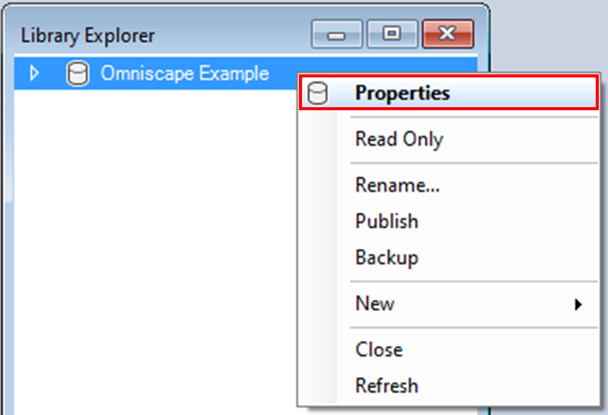
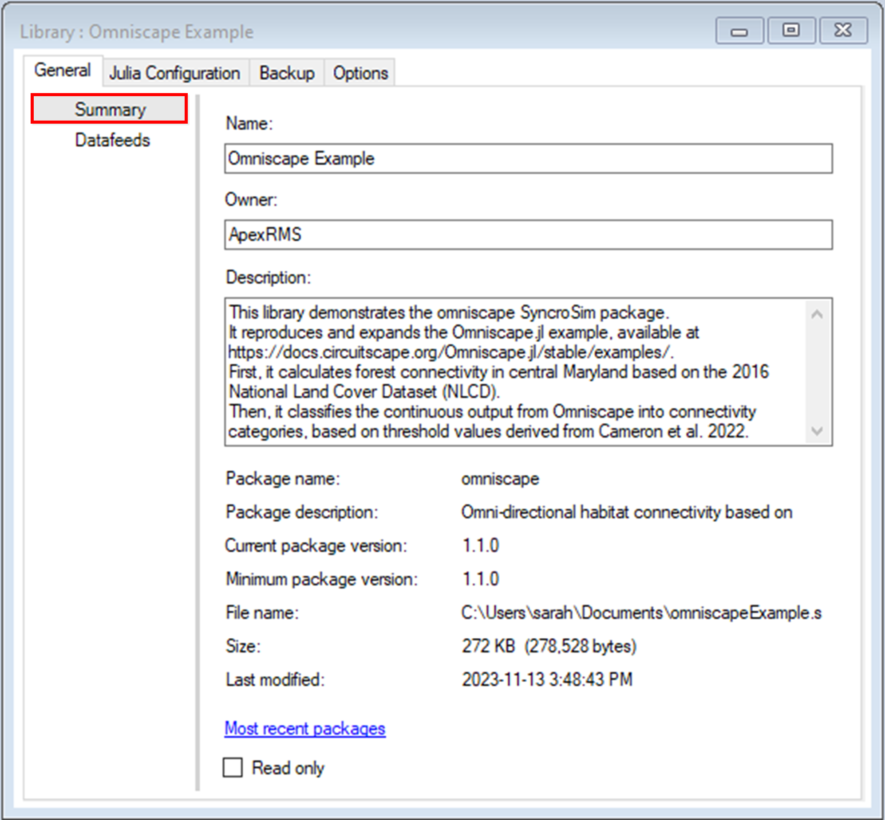
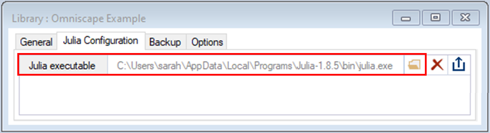
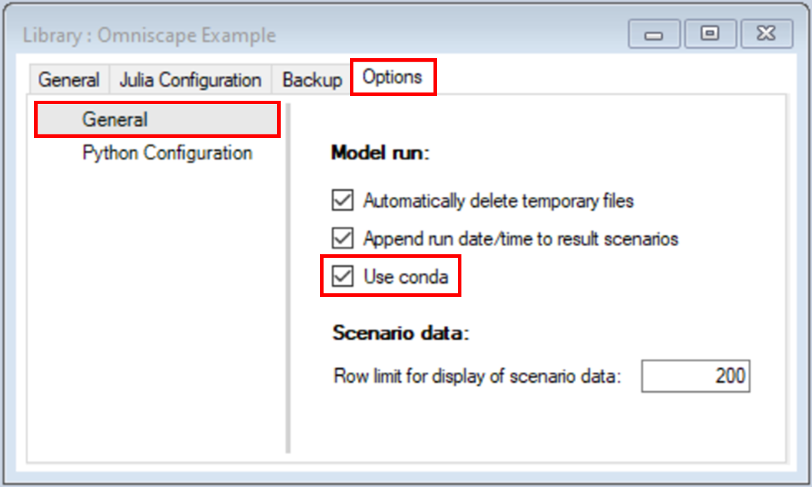
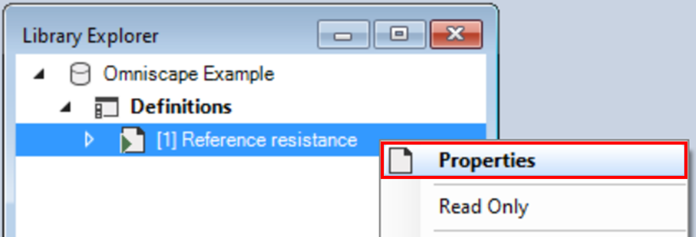
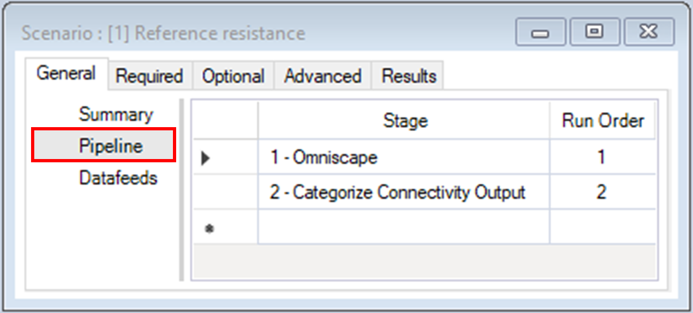
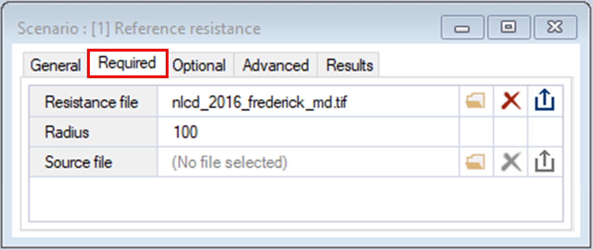
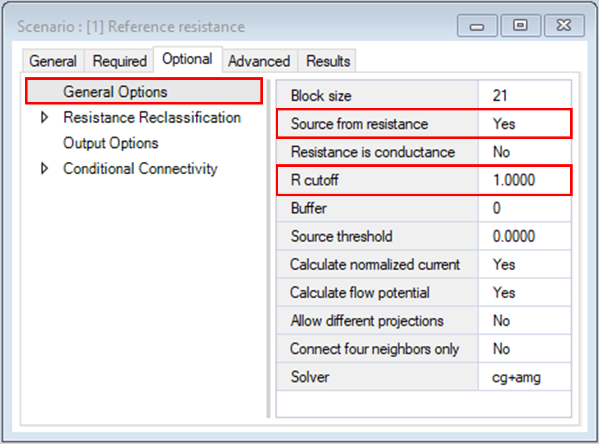
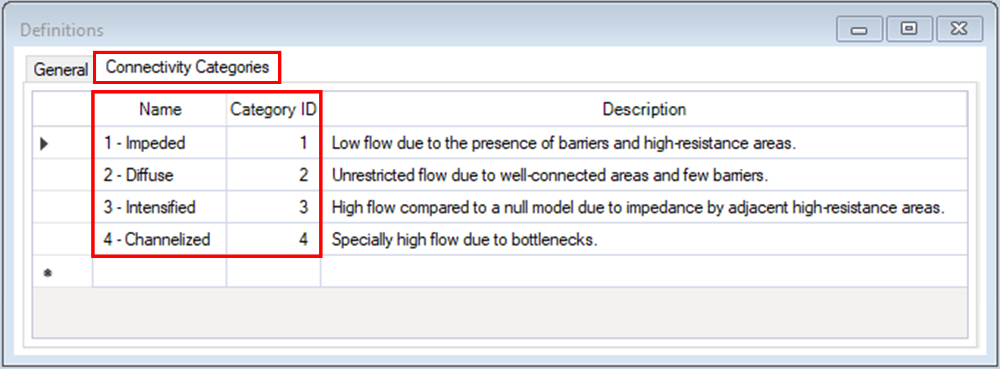

## **Reproducing the Omniscape.jl example with omniscape SyncroSim**

This tutorial provides an overview of working with omniscape SyncroSim in the Windows user interface. It covers the following steps:

1. <A href="#step-1.-creating-and-configuring-an-omniscape-syncrosim-library">Creating and configuring an omniscape SyncroSim Library</A>
2. <A href="#step-2.-visualizing-scenario-results">Visualizing scenario results</A>
3. <A href="#step-3.-creating,-editing,-and-running-a-new-scenario">Creating, editing, and running a new scenario</A>
4. <A href="#step 4.-comparing-results-across-scenarios">Comparing results across scenarios</A>

 

**Step 1. Creating and configuring an omniscape SyncroSim Library**

In SyncroSim, a library is a file with extension .ssim that stores all the model’s inputs and outputs in a format specific to a given package. To create a new library:

1\.	Open SyncroSim Desktop.
2\.	Select **File > New**.

a.	From the list of packages, select **omniscape**. Three template library options will be available: Empty Library, Omniscape Example, and Omniscape Impact.

b\.	Select the **Omniscape Example** template library. If desired, you may edit the *File name*, and change the *Folder* by clicking on the *Browse* button. Click **OK**.

A new library has been created based on the selected template. SyncroSim will automatically open and display it in the Library Explorer window.

3\.	Double-click on the library name, **Omniscape Example**, to open the library properties window. You may also right-click on the library name and select **Properties** from the context menu.

4\.	The *Summary* datasheet contains the metadata for the library.

5\.	Navigate to the **Julia Configuration tab**.

The path to the **Julia executable** file must be specified to run **omniscape** SyncroSim. To do so, click on the folder icon and navigate to where Julia is installed in your computer. Its default location is **C:\Users\[User_Name]\AppData\Local\Programs\Julia-[version]\bin\julia.exe**. 

> **Note:** The AppData folder is sometimes hidden. To see it, in File Explorer, select View > Show > Hidden items.

6\.	Next, navigate to the **Options** tab.

In the *General* datasheet, mark the checkbox for **Use conda**.

7\.	Close the library properties window.

Next, you will review the inputs of the *Reference resistance* scenario. In SyncroSim, each scenario contains the model inputs and outputs associated with a model run.

1.	In the Library Explorer window, select the pre-configured scenario **Reference resistance** and double-click it to open its properties. You may also right-click on the scenario name and select **Properties** from the context menu.

2.	Navigate to the **Pipeline** datasheet.

  a.	Under the Stage column, note that two pipeline stages are set in the following order:
    i.	*Omniscape* – runs Omniscape.jl 
    ii.	*Categorize Connectivity Output* – classifies the continuous output from Omniscape.jl into connectivity categories based on a set of threshold values
Each pipeline stage calls on a transformer (*i.e.*, script) which takes the inputs from SyncroSim, runs a model, and returns the results to SyncroSim.

The *Omniscape* pipeline stage replicates the exact structure and order of parameters as Omniscape.jl with inputs organized in two tabs: *Required* and *Optional*. 
3\.	Navigate to the **Required** tab, which contains the following inputs:
  a.	*Resistance file* – a raster file of land cover or resistance classes. For this example, the pre-loaded raster corresponds to the 2016 National Land Cover Dataset for central Maryland.
  b.	*Radius* – sets the radius of the moving window. This example uses a radius of 100 pixels.
  c.	*Source file* – a raster file indicating which pixels correspond to sources. In this example, the sources are set through a different method, described in the next step.

4\.	Navigate to the **Optional** tab.
  a.	Under the *General Options* datasheet, note that *Source from resistance* is set to *Yes*, enforcing that the sources be calculated from the resistance layer based on a threshold of 1 as defined by *R cutoff*.
  

  b.	Navigate to the **Resistance Reclassification** node and review the following inputs:
    i.	*Options > Reclassify resistance* – determines whether the *Resistance file* should be reclassified. For this example, it is set to *Yes* since the *Resistance file* provided in step 11.a corresponded to a raster of land cover classes.
    ii.	*Options > Write reclassified resistance* – determines whether the reclassified resistance raster should be saved and written to file. 

  iii.	*Reclass table* – a reclassification matrix used to translate land cover classes into resistance values.
    

The *Categorize Connectivity Output* pipeline stage is an exclusive feature of the **omniscape** SyncroSim package. It allows for seamless post-processing of the continuous output of Omniscape into discrete connectivity categories based on user-defined connectivity categories, a common step in the Omniscape workflow.
5\.	In the Library Explorer, double-click on **Definitions** to open the project properties. You may also right-click on the project name and select **Properties** from the context menu. 

6\.	Under the *Summary* datasheet, the *Description* field highlights that the connectivity categories and thresholds used in the template library were derived from Cameron *et al.* (2022, Conservation Science and Practice).
7\.	Navigate to the **Connectivity Categories** tab.
  a.	Note that four connectivity categories have been defined, each associated with an ID value.
  b.	Click on the **Category ID** column to sort categories in ascending order, where *Impeded* represents areas with the least amount of flow, and *Channelized* represents areas with the greatest amount to flow.

8\.	Return to the scenario properties window, navigate to the **Advanced** tab.

Note that each connectivity category is associated with a minimum and maximum value, defining the range of normalized current flow that will be reclassified into each connectivity category.
9\.	Close the scenario properties window.

_**Step 2. Visualizing scenario results**_
The Omniscape Example template library already contains the results for the *Reference resistance* scenario. In SyncroSim, the results for a scenario are organized into a *Results* folder, nested within its parent scenario. 
1\.	In the Library Explorer window, click on the arrow beside the *Reference resistance* scenario to expose the *Results* folder; repeat the same action to expose the results scenario. 

2\.	Double-click on the results scenario to open its properties.
  a.	Click through the **Required**, **Optional** and **Advanced** tabs and note that the results scenario is a copy of the parent scenario’s inputs, which are greyed out. 
  
  
  
  b.	Navigate to the **Results** tab, which lists the spatial and tabular outputs. Both pipeline stages have spatial outputs but only the second pipeline stage has tabular outputs.
    i.	Under the **Spatial** node, the outputs from the first and second transformers are organized under the *Omniscape Outputs* and *Connectivity Categories* datasheets, respectively.
    You can export any spatial output by clicking on the *Export* button.
    
  
  
  ii.	Under the **Tabular** node, the output of the second transformer is saved to the *Connectivity Categories Summary* datasheet.
  You can export the tabular output by right-clicking on the data and selecting *Export All* from the context menu.
  

3\.	Close the results scenario properties.

Using the SyncroSim built-in tools, you will now visualize the outputs of the first transformer.
4\.	In the Library Explorer window, right-click on the **Reference resistance** scenario and select **Add to Results** from the context menu. 

5\.	Navigate to the **Maps** tab and double-click on the first pre-configured map, **Cumulative current flow**. 

The cumulative current flow represents the total current flowing through the landscape. To inspect the map, consider the following:
  a.	*Map legend* – displayed along the left-hand side of the window. It can be edited by double-clicking it.
  b.	*Toolbar* – displayed along the top of the window. Includes zoom, pan and per pixel information tooltip.

6\.	Close the map window and view the two following maps.
  a.	**Flow potential** represents current flow under the null condition of resistance set to 1 for the entire landscape. 

  b.	**Normalized current flow** is calculated as flow potential divided by cumulative current, and therefore represents where there is more or less current than expected under null resistance conditions.

Next, you will visualize the outputs of the second transformer, which takes the *Normalized current flow* map and reclassifies it into a discrete map, based on the threshold values reviewed in steps 13-17.
7\.	View the **Connectivity categories** map.
8\.	Keep the map open for comparison and from the Library Explorer window, navigate to the **Charts** tab and view the **Area** chart. 

Note that it summarized the amount of area per connectivity category.
Alternatively, a **Percent cover** summary is also available.

9\.	Close all plot windows.

_**Step 3. Creating, editing, and running a new scenario**_
Next, you will learn how to create a scenario and run it to generate results. This scenario will differ from the *Reference resistance* by a ten-fold increase in resistance for all non-forest (i.e., non-source) pixels. 
1\.	Right-click on the existing scenario and select **Copy** from the context menu. 

Then, right-click anywhere inside the Library Explorer window and select **Paste**.

2\.	Double-click on the new scenario to open its properties.
  a.	Change the **Name** to *Increased resistance*. 
  b.	Change the **Description** to *Resistance values for non-forest land cover types were increased by one order of magnitude. All other configuration options for Omniscape are equal to those implemented in the Omniscape.jl example*.
  

3\.	Navigate to the **Optional** tab and under the **Resistance Reclassification** node, open the **Reclass table** datasheet.
  a.	Under the **Resistance value** column, increase values by one order of magnitude, except for *Land cover class* 41, 42, and 43, which represent forest classes.

4\.	Close the scenario properties window and save the changes to the library.

Next, you will run the scenario. For this example, the run should take approximately 5 minutes with multiprocessing enabled across 5 cores.
5\.	To enable multiprocessing, click on the **Multiprocessing** button along the SyncroSim toolbar and adjust the number of **Multiprocessing jobs** to 5.

6\.	In the Library Explorer window, right-click on the **Increased resistance** scenario and select **Run** for the context menu.

  a.	The Run Monitor window will open, informing that the model is Running.
  

  b.	Along the bottom-right of the window, a progress bar will provide further details.
  c.	First, SyncroSim calls the first transformer, *Omniscape*. 
    i.	*Setting up Scenario* – the transformer takes the inputs and pre-processes them into the format required by Julia. 
    ii.	*Running Omniscape* – the transformer calls Julia to run the analysis. Once the analysis is complete, the transformer retrieves and saves the outputs back to SyncroSim. 
  d.	Then, SyncroSim call the second transformer, *Categorize Connectivity Output*. 
    i.	*Setting up Scenario* – the transformer takes an output from the first transformer along with the connectivity categories and their threshold values.
    ii.	*Categorizing connectivity output* – the transformer reclassifies the continuous output and returns it back to SyncroSim.
7\.	When the run is complete, the *Status* will be updated to *Done*. You can inspect the **Run Log**, which returns the total run time for the scenario. 

_**Step 4. Comparing results across scenarios**_
With two successful scenario runs, you will now compare their results. 
1\.	Ensure that both scenarios are added to the results. This is noted by a red check mark beside the scenario symbol and a bolded scenario name. 

If required, right-click on the scenario(s) and select **Add to Results** from the context menu.
2\.	First, view the **Area** chart.

Note that the increase in resistance resulted in a small increase in the amount of *Impeded* and *Channelized* areas, and a decrease in the amount of *Diffuse* and *Intensified* areas.  
3\.	Next, view the **Connectivity categories** map. 
Zoom in and pan through the map and try to identify where across the landscape those changes in connectivity occurred.

Visually identifying areas of change between scenarios may not be straightforward. For more quantitative tools to compare changes in connectivity, see the next tutorial <A href="#measuring-the-impact-of-connectivity-change-with-omniscapeimpact">Measuring the impact of connectivity change with **omniscapeImpact**</A>.

